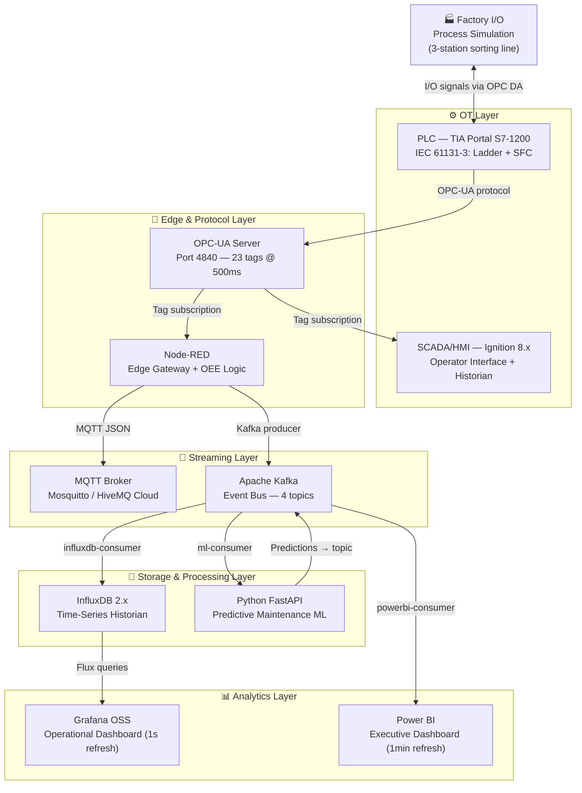

<div align="center">

# 🏭 SmartLine 360

### Digital Factory Intelligence Platform

*Complete Industry 4.0 OT-IT architecture — from PLC control to executive dashboard*

[](https://opensource.org/licenses/MIT)
[](https://github.com/youness-tebbaq/SmartLine-360)
[](https://python.org)
[](https://docker.com)
[](https://kafka.apache.org)
[](https://influxdata.com)
[](https://grafana.com)
[](https://powerbi.microsoft.com)
[](https://nodered.org)

**[Architecture](#️-system-architecture)** · **[Quick Start](#-quick-start)** · **[Tech Stack](#-technology-stack)** · **[Docs](#-documentation)**

</div>

---

## 📋 Table of Contents

- [Overview](#-overview)
- [System Architecture](#️-system-architecture)
- [Technology Stack](#-technology-stack)
- [Key Features](#-key-features)
- [Project Metrics](#-project-metrics)
- [Quick Start](#-quick-start)
- [Repository Structure](#-repository-structure)
- [Documentation](#-documentation)
- [Dashboards](#-dashboards)
- [Roadmap](#-roadmap)
- [About This Project](#-about-this-project)
- [Author](#-author)
- [License](#-license)

---

## 📌 Overview

**SmartLine 360** is a reference implementation of a complete Industry 4.0 data pipeline built around a simulated 3-station production line (detection → inspection → sorting). It demonstrates the full **OT-IT integration stack** — from real-time PLC logic to predictive maintenance AI and executive-level analytics — using the same tools and architectural patterns deployed in real smart factories.

The project was built to answer one question:

> *"What does the complete data journey from a physical sensor to a management dashboard actually look like — and how do you build it?"*

The answer spans **9 technologies across 7 architecture layers**, connected into a single coherent system with **sub-2-second end-to-end latency**.

### Context

This project was developed as part of a **Master's in Industrial Technologies for the Factory of the Future (TIUF)** at [UM6P — Green Tech Institut (GTI)](https://www.um6p.ma), Ben Guerir, Morocco. It serves both as a capstone technical portfolio and as a practical reference for IIoT architecture patterns.

---

## 🏗️ System Architecture

The system is organized into **7 horizontal layers**, each with a distinct role in the OT-IT stack. Data flows upward from physical simulation to analytics, with two independent dashboarding paths serving different audiences.



### Data Flow Summary

| From | To | Protocol | Frequency | Latency |
|------|----|----------|-----------|---------|
| Factory I/O | TIA Portal | OPC DA | 10ms scan | ~2ms |
| TIA Portal | OPC-UA Server | Internal | 100ms | ~5ms |
| OPC-UA | Node-RED | OPC-UA subscription | 500ms | ~8ms |
| Node-RED | Kafka | Kafka producer | 1Hz | ~12ms |
| Kafka | InfluxDB | Consumer group | Continuous | ~18ms |
| InfluxDB | Grafana | Flux query | 1s refresh | ~1000ms |
| Kafka | Power BI | Streaming API | 1min | ~60s |

**Total latency — sensor to operator dashboard: < 2 seconds.**

---

## 🛠️ Technology Stack

| Layer | Technology | Role | Cost |
|-------|------------|------|------|
| **Simulation** | [Factory I/O](https://factoryio.com) | Realistic PLC simulation environment | 30-day trial |
| **PLC Control** | [TIA Portal S7-1200](https://www.siemens.com/tia-portal) | IEC 61131-3 automation logic | Trial |
| **SCADA/HMI** | [Ignition 8.x](https://inductiveautomation.com) | Operator interface + tag historian | Demo |
| **Protocol** | OPC-UA (native) | Structured industrial data standard | Free |
| **Edge Gateway** | [Node-RED](https://nodered.org) | OT-IT integration + OEE computation | ✅ Free |
| **Messaging** | [MQTT + Apache Kafka](https://kafka.apache.org) | Real-time transport + event streaming | ✅ Free |
| **Historian** | [InfluxDB 2.x](https://influxdata.com) | Time-series data storage | ✅ Free |
| **Ops Dashboard** | [Grafana OSS](https://grafana.com) | Real-time factory floor monitoring | ✅ Free |
| **ML Inference** | [Python FastAPI](https://fastapi.tiangolo.com) + scikit-learn | Predictive maintenance model serving | ✅ Free |
| **BI Dashboard** | [Power BI](https://powerbi.microsoft.com) | Management-level production analytics | Free (Desktop) |
| **Containerization** | [Docker Compose](https://docs.docker.com/compose) | One-command deployment of analytics stack | ✅ Free |

---

## ✨ Key Features

### OT Layer
- **Full PLC program** in IEC 61131-3: Ladder logic for I/O control + SFC (GRAFCET) for production sequence
- **Auto/Manual/Fault mode management** with proper state machine implementation
- **OEE data collection** at PLC level: planned time, actual run time, production count, reject count
- **4 Ignition HMI screens**: production overview, real-time KPIs, active alarms, 24h trend viewer

### Integration Layer
- **OPC-UA bridge**: 23 tags exposed at 500ms update rate — production counters, equipment status, quality flags, alarm states
- **Node-RED OEE engine**: computes Availability × Performance × Quality every 60 seconds from raw PLC data
- **Dual output**: single Node-RED flow fans out to both MQTT (operator alerts) and Kafka (analytics pipeline)

### Analytics Layer
- **3 independent Kafka consumer groups**: InfluxDB historian, Power BI streaming, Python ML model — each reads at its own pace with guaranteed delivery and replay capability
- **Predictive maintenance AI**: Random Forest model trained on NASA CMAPSS Turbofan Degradation dataset, >80% fault detection accuracy, deployed as FastAPI microservice
- **Grafana operator dashboard**: live OEE gauge, production rate trend (24h), alarm timeline, fault probability indicator
- **Power BI executive report**: shift production vs target, weekly OEE benchmarking, quality defect heatmap, line comparison

### Infrastructure
- **One-command deployment**: `docker-compose up -d` starts Kafka, InfluxDB, and Grafana in under 90 seconds
- **Complete documentation**: architecture decision records, setup guides, troubleshooting runbook

---

## 📊 Project Metrics

| Metric | Value |
|--------|-------|
| OPC-UA tags monitored | 23 tags at 500ms |
| End-to-end latency | < 2 seconds (sensor → Grafana) |
| Kafka topics | 4 (production-events, quality-events, alarm-events, predictions) |
| Consumer groups | 3 independent (InfluxDB, Power BI, ML model) |
| ML model accuracy | > 80% (NASA CMAPSS benchmark) |
| Dashboard refresh — Grafana | 1 second (operator) |
| Dashboard refresh — Power BI | 60 seconds (executive) |
| Technologies integrated | 9 |
| Architecture layers | 7 |
| Docker services | 4 (Kafka, Zookeeper, InfluxDB, Grafana) |

---

## 🚀 Quick Start

### Prerequisites

| Tool | Version | Notes |
|------|---------|-------|
| Docker + Docker Compose | Latest | For Kafka, InfluxDB, Grafana |
| Python | 3.11+ | ML inference service |
| Node.js | 18+ | Node-RED |
| TIA Portal | V18 (trial) | PLC programming |
| Factory I/O | Any (30-day trial) | Process simulation |
| Ignition | 8.x (demo) | SCADA/HMI |

### 1 — Clone the repository

```bash
git clone https://github.com/youness-tebbaq/SmartLine-360.git
cd SmartLine-360
```

### 2 — Start the analytics infrastructure

```bash
# Starts Kafka, Zookeeper, InfluxDB 2.x, and Grafana
cd docker
docker-compose up -d

# Verify all services are healthy
docker-compose ps
```

Services started:

| Service | URL | Credentials |
|---------|-----|-------------|
| Grafana | http://localhost:3000 | admin / admin |
| InfluxDB | http://localhost:8086 | admin / password123 |
| Kafka | localhost:9092 | No auth (local) |

### 3 — Start Node-RED

```bash
npm install -g node-red
node-red

# Import the flow
# Open http://localhost:1880 → Menu → Import → select node-red-flows/main-flow.json
```

### 4 — Start the Python ML service

```bash
cd ml-service
pip install -r requirements.txt
uvicorn main:app --host 0.0.0.0 --port 8000
```

### 5 — Configure PLC and SCADA

1. Open `plc-programs/SmartLine360.ap17` in TIA Portal V18
2. Enable the built-in OPC-UA server on the S7-1200 (port 4840)
3. Download to the PLC simulator
4. Open `factory-io-scenes/SmartLine_3Station.factoryio` in Factory I/O
5. Import `ignition-projects/SmartLine360.zip` into Ignition Designer

For detailed setup instructions see [`docs/SETUP.md`](docs/SETUP.md).

---

## 📁 Repository Structure

```
SmartLine-360/
│
├── README.md                       # You are here
│
├── docs/                           # Full documentation
│   ├── ARCHITECTURE.md             # System design decisions and data flow detail
│   ├── SETUP.md                    # Complete step-by-step installation guide
│   ├── DEVELOPMENT.md              # How to modify and extend the project
│   ├── DEPLOYMENT.md               # Production-style deployment guide
│   └── TROUBLESHOOTING.md          # Common issues, solutions, and error messages
│
├── plc-programs/                   # TIA Portal project files
│   └── SmartLine360.ap17           # S7-1200 program (Ladder + SFC + OEE data collection)
│
├── factory-io-scenes/              # Process simulation
│   └── SmartLine_3Station.factoryio  # 3-station sorting + inspection scene
│
├── ignition-projects/              # SCADA/HMI
│   └── SmartLine360.zip            # Ignition project export (4 HMI screens + historian)
│
├── node-red-flows/                 # Edge integration
│   ├── main-flow.json              # Main OPC-UA → MQTT → Kafka pipeline
│   └── oee-engine.json             # OEE computation function node
│
├── docker/                         # Infrastructure as code
│   ├── docker-compose.yml          # Kafka + Zookeeper + InfluxDB + Grafana
│   ├── influxdb/
│   │   └── init.sh                 # Bucket and token initialization
│   └── grafana/
│       └── dashboards/             # Pre-built dashboard JSON exports
│
├── ml-service/                     # Predictive maintenance AI
│   ├── main.py                     # FastAPI application
│   ├── model.py                    # Random Forest training + inference
│   ├── kafka_consumer.py           # Kafka consumer for equipment-status topic
│   ├── requirements.txt
│   └── notebooks/
│       └── training.ipynb          # Model development on NASA CMAPSS dataset
│
├── power-bi/                       # Executive analytics
│   └── SmartLine360_Executive.pbix # Power BI dashboard (shift KPIs, OEE benchmarking)
│
└── assets/                         # Visual documentation
    ├── architecture-diagram.drawio  # Editable architecture diagram (draw.io)
    ├── architecture-diagram.svg     # Architecture diagram for README
    ├── screenshots/                 # Dashboard screenshots
    └── demo/                       # Demo video
        └── demo.gif                # 30-second demo of the full pipeline
```

---

## 📚 Documentation

| Document | Description |
|----------|-------------|
| [`docs/ARCHITECTURE.md`](docs/ARCHITECTURE.md) | Detailed architecture decisions, protocol choices (why OPC-UA vs MQTT, why Kafka vs plain MQTT), IEC 62443 security zones |
| [`docs/SETUP.md`](docs/SETUP.md) | Prerequisites, step-by-step installation for all components, network configuration |
| [`docs/DEPLOYMENT.md`](docs/DEPLOYMENT.md) | Running the full stack, environment variables, Docker volume management |
| [`docs/DEVELOPMENT.md`](docs/DEVELOPMENT.md) | Adding new sensors/tags, extending the ML model, creating new Grafana panels |
| [`docs/TROUBLESHOOTING.md`](docs/TROUBLESHOOTING.md) | OPC-UA connection issues, Kafka consumer lag, InfluxDB write errors, Node-RED flow debugging |

---

## 🖥️ Dashboards

### Grafana — Operational Dashboard (factory floor, 1s refresh)

> *Screenshot coming soon — see `assets/screenshots/grafana-ops.png`*

Panels:
- **OEE Gauge** — current shift OEE with threshold coloring (red < 65%, amber < 80%, green ≥ 80%)
- **Production Rate Trend** — units/hour over the last 8 hours
- **Alarm Timeline** — active and resolved alarms with duration
- **Fault Probability** — ML model output 0–100%, turns red above 70%

### Power BI — Executive Dashboard (management, 1min refresh)

> *Screenshot coming soon — see `assets/screenshots/powerbi-executive.png`*

Pages:
- **Shift Overview** — planned vs actual production, OEE, reject rate
- **Weekly Benchmark** — OEE trend, best/worst shift analysis
- **Quality Analysis** — defect heatmap by hour and product type

### Ignition SCADA — Operator HMI

> *Screenshot coming soon — see `assets/screenshots/ignition-hmi.png`*

Screens:
- **Production Overview** — live conveyor synoptic, station states
- **KPI Screen** — real-time counters, cycle time, OEE gauge
- **Alarm Screen** — active alarm list, acknowledge/shelve
- **Trend Screen** — 24-hour historian trends for any tag

---

## 🗺️ Roadmap

| Status | Feature |
|--------|---------|
| ✅ Done | PLC program — Ladder + SFC + OEE data blocks |
| ✅ Done | Factory I/O scene + OPC-UA connection to TIA Portal |
| ✅ Done | Node-RED OPC-UA subscription + OEE computation |
| ✅ Done | Kafka event streaming with 3 consumer groups |
| ✅ Done | InfluxDB time-series storage + Grafana operational dashboard |
| 🔄 In progress | Python ML service — predictive maintenance (NASA CMAPSS) |
| 🔄 In progress | Power BI executive dashboard |
| 🔄 In progress | Ignition SCADA screens |
| 📋 Planned | IEC 62443 OT network segmentation diagram (Cisco Packet Tracer) |
| 📋 Planned | AWS IoT Core integration for cloud broker |
| 📋 Planned | Demo video — full pipeline walkthrough |
| 📋 Planned | GitHub Actions CI for Python ML tests |

---

## 🎓 About This Project

This project was designed around a **project-based learning** approach. Every technology was added because the project architecture required it — not the other way around.

**Key engineering decisions documented:**

- **Why OPC-UA at the OT layer, not MQTT?** OPC-UA provides a structured information model with typed data, built-in security (X.509 certificates), bidirectional communication, and complex types. MQTT is a transport protocol — lightweight and scalable, but it only carries raw bytes. At the OT layer, structured data access with security matters more than lightweight transport. → See [`docs/ARCHITECTURE.md`](docs/ARCHITECTURE.md)

- **Why Kafka in addition to MQTT?** Three consumers need the same data stream independently and at different speeds. Kafka's consumer group model guarantees each consumer reads every event at its own pace, with replay capability if one goes down. MQTT doesn't offer durability or fan-out to independent consumers. → See [`docs/ARCHITECTURE.md`](docs/ARCHITECTURE.md)

- **Why Grafana AND Power BI?** They serve entirely different audiences. Grafana refreshes every second for factory floor operators who need live process values. Power BI aggregates data for plant managers who need shift summaries and trend analysis. Using only one would mean either operators see stale data or managers see raw noise. → See [`docs/ARCHITECTURE.md`](docs/ARCHITECTURE.md)

**Skills demonstrated by this project:**

- IEC 61131-3 PLC programming (Ladder, SFC, Function Blocks)
- OPC-UA protocol architecture and Python client implementation
- Node-RED flow-based programming for industrial integration
- Apache Kafka event streaming architecture and consumer groups
- InfluxDB time-series data modeling and Flux query language
- Grafana dashboard design and alerting configuration
- Power BI data modeling and streaming dataset integration
- Scikit-learn predictive maintenance model development and deployment
- Docker Compose multi-service orchestration
- OEE computation from raw PLC I/O data

---

## 👨‍💻 Author

**Youness Tebbaq**

Master's student in Industrial Technologies for the Factory of the Future (TIUF)
UM6P · Green Tech Institut (GTI) · Ben Guerir, Morocco

| | |
|--|--|
| 📧 | youness.tebbaq1@gmail.com |
| 💼 | [www.linkedin.com/in/youness-tebbaq-135634276] |
| 📍 | Casablanca, Morocco |
| 🎯 | Seeking PFA internship in industrial automation / IIoT |

**Other projects and experience:**
- 🚗 Embedded BMS monitoring system — STM32 + CAN bus — Renault Arkana Hybrid (Internship, M-AUTOMOTIV)
- 🏭 Industrial heating system automation — PLC Zelio + FAT/SAT validation (Internship, Procter & Gamble)
- 🤖 3D parametric robot modelling — SolidWorks (CSWA certified)
- 📊 Discrete-event simulation — Chromium plating line — Arena + Power BI KPI dashboard

---

## 🙏 Acknowledgements

- [Inductive Automation](https://inductiveautomation.com) — Ignition free demo + Ignition Core Certification
- [NASA AMES](https://ti.arc.nasa.gov/tech/dash/groups/pcoe) — CMAPSS Turbofan Degradation Dataset (public domain)
- [HiveMQ](https://hivemq.com) — MQTT Essentials educational resources
- [Factory I/O](https://factoryio.com) — Realistic PLC simulation platform

---

## 📄 License

This project is licensed under the **MIT License** — see the [LICENSE](LICENSE) file for details.

You are free to use, modify, and distribute this project for educational and non-commercial purposes. Attribution appreciated.

---

<div align="center">

*Built with purpose by a student who believes that the best way to learn IIoT is to build the whole stack, not just the parts.*

⭐ **If this project helped you understand industrial IoT architecture, consider starring the repository.**

</div>
