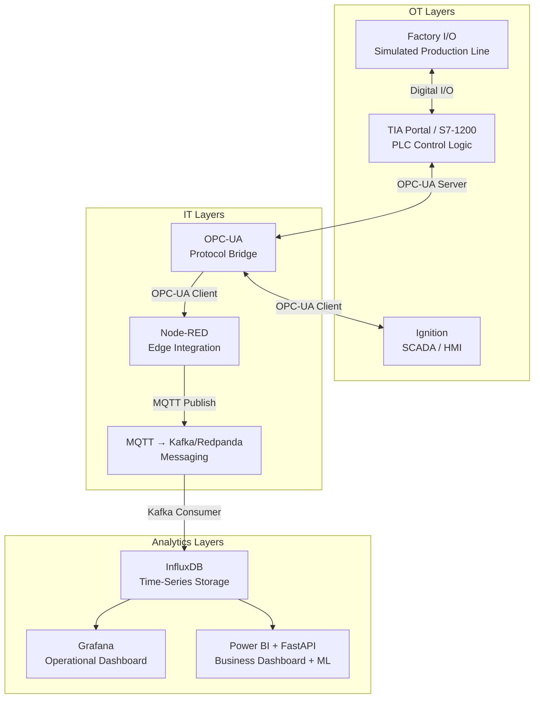

# Architecture — SmartLine 360

Digital Factory Intelligence Platform: a complete OT-IT pipeline from a
simulated PLC-controlled production line to operational and business
dashboards, built on 9 technologies across 7 architecture layers.

## Table of Contents
- [System Overview](#system-overview)
- [Architecture Diagram](#architecture-diagram)
- [Layer-by-Layer Breakdown](#layer-by-layer-breakdown)
- [Physical Process Design](#physical-process-design)
- [Data Flow — Step by Step](#data-flow--step-by-step)
- [Design Decisions](#design-decisions)
- [Repository Mapping](#repository-mapping)

---

## System Overview

SmartLine 360 simulates a 3-station production line (infeed/sorting →
assembly → packaging/palletizing) and pipes its operational data through a
full OT → IT stack in real time:

```
Physical Process → Control → SCADA → Protocol Bridge → Edge → Messaging → Storage → Visualization
```

Everything runs on a single laptop (16 GB RAM) using free or trial tools —
no physical hardware required.

---

## Architecture Diagram



---

## Layer-by-Layer Breakdown

| # | Layer | Technology | Role |
| - | --- | --- | --- |
| 1 | Simulation | Factory I/O | Simulates the physical production line: conveyors, sensors, actuators, stations. Exposes every sensor/actuator as a tag. |
| 2 | Control | TIA Portal (S7-1200) | Runs the PLC logic that reads sensor tags and drives actuator tags — the actual "brain" of the physical process. |
| 3 | SCADA/HMI | Ignition | Gives a human-operable view/control surface over the PLC via OPC-UA — overview screens, alarms. |
| 4 | Protocol Bridge | OPC-UA | Industrial-standard protocol exposing PLC data to any OPC-UA client (Ignition, Node-RED) without custom drivers per consumer. |
| 5 | Edge Integration | Node-RED | Reads OPC-UA tags and republishes them as MQTT messages — the translation point between OT and IT protocols. |
| 6 | Messaging | MQTT → Kafka/Redpanda | MQTT for lightweight pub/sub at the edge; bridged into Kafka for durable, scalable stream processing further downstream. |
| 7 | Storage | InfluxDB | Purpose-built time-series database for high-frequency sensor/actuator data with efficient time-range queries. |
| 8 | Operational Dashboard | Grafana | Real-time, ops-facing view of the line: station status, throughput, alarms — reads directly from InfluxDB. |
| 9 | Business Dashboard + ML | Power BI + Python FastAPI | Executive-facing KPIs and, optionally, a predictive-maintenance model served via FastAPI and surfaced in Power BI. |

---

## Physical Process Design

The Factory I/O scene models 3 stations (see
[`factory-io-scenes/`](../factory-io-scenes/) and the build guide there for
exact parts and layout):

1. **Station 1 — Infeed & Color Sorting**: an Emitter spawns Raw Material
   (Blue/Green/Metal), a Diffuse Sensor detects presence, a Vision Sensor
   reads color, and Pushers divert items onto color-specific lanes.
2. **Station 2 — Assembly**: Product Base and Product Lid are emitted,
   aligned with Positioning Bars, and combined by a Two-Axis Pick & Place
   into a Final Product. A second Vision Sensor performs quality control;
   failed assemblies are rejected by a Pusher.
3. **Station 3 — Packaging & Palletizing**: good Final Products are conveyed
   to a Palletizer station, which stacks them (optionally boxed via a
   Pick & Place into a Stackable Box first) onto a Pallet.

Every sensor and actuator across all 3 stations is exposed as a Factory I/O
tag, mapped to the S7-1200 PLC via the Siemens S7-1200/1500 driver.

---

## Data Flow — Step by Step

1. An item moves through the simulated line in Factory I/O; a sensor tag
   changes value (e.g. `ColorSensor_S1` reports "Blue").
2. The S7-1200 PLC (TIA Portal logic, running on PLCSIM or hardware) reads
   that tag over the S7 connection and executes the relevant logic (e.g.
   trigger the correct Pusher).
3. The PLC's internal tags are exposed via an **OPC-UA server** running
   alongside/within the PLC simulation.
4. **Ignition** subscribes to those OPC-UA tags for the HMI view. Separately,
   **Node-RED** also subscribes via its OPC-UA client node.
5. Node-RED republishes each value change as an **MQTT** message on a
   topic such as `smartline360/station1/colorsensor`.
6. A Node-RED (or standalone) bridge consumes that MQTT topic and produces
   it onto a **Kafka/Redpanda** topic, giving the data a durable, replayable
   stream.
7. A Kafka consumer (Telegraf or a small Python script) writes each message
   into **InfluxDB** as a timestamped point.
8. **Grafana** queries InfluxDB directly for real-time operational panels.
9. **Power BI** (and optionally a Python **FastAPI** service running a
   scikit-learn model) queries InfluxDB or a downstream export for
   business-level KPIs and predictions.

---

## Design Decisions

| Decision | Rationale |
| --- | --- |
| MQTT **and** Kafka, not just one | MQTT is lightweight and ideal at the edge (Node-RED, constrained devices); Kafka adds durability, replay, and scalability for downstream consumers — mirrors real Industry 4.0 stacks where both coexist. |
| Redpanda as a Kafka alternative | Kafka-API-compatible but lighter weight — friendlier to a 16 GB laptop running several other services simultaneously. |
| InfluxDB over a general-purpose DB | Purpose-built for time-series workloads (sensor data), with efficient downsampling and time-range queries that Grafana/Power BI need. |
| Two dashboards (Grafana + Power BI) | Deliberately mirrors a real organization: Grafana for operational/engineering users, Power BI for business/executive stakeholders — different audiences, different KPIs. |
| Docker Compose for the IT layers | Keeps Kafka/InfluxDB/Grafana reproducible and disposable — anyone cloning the repo can bring the IT stack up with one command. |

---

## Repository Mapping

| Repo path | Layer(s) |
| --- | --- |
| `factory-io-scenes/` | Simulation |
| `plc-programs/` | Control |
| `ignition-projects/` | SCADA/HMI |
| `node-red-flows/` | Protocol Bridge, Edge Integration, Messaging (OPC-UA → MQTT → Kafka) |
| `docker/` | Messaging (Kafka/Redpanda), Storage (InfluxDB), Operational Dashboard (Grafana) |
| `power-bi/` | Business Dashboard + ML |
| `docs/` | Project management and this architecture documentation |
| `assets/` | Diagrams, screenshots, demo video |
